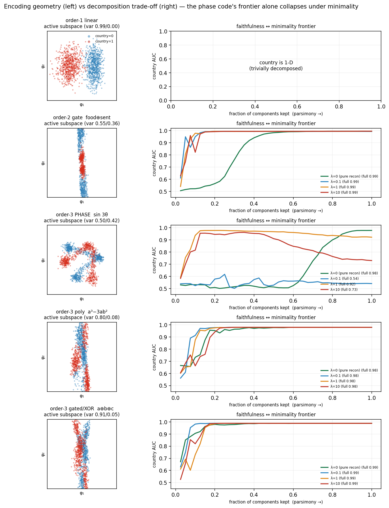

# Does feature interaction degrade the separability of parameter decomposition?

A toy-scale, ground-truth-known study of how a feature's **encoding geometry** affects
how cleanly its weights decompose. We started from an *interaction-order* hypothesis
(higher order → harder to decompose) but — after running the real APD/SPD solver and a
multi-agent adversarial audit (`AUDIT.md`) that overturned three of our own framings —
the finding sharpened to: it is the **encoding geometry**, not the order, that matters,
and a **smooth periodic ("phase") code is the unique outlier** (full result in the claim
box below).

The setup is the BlueDot "pinwheel" puzzle head: a frozen MiniLM encoder + a small MLP
predicting 8 binary text features. Seven are linear at the analyzed layer **L**; the
country feature is re-encoded several ways — and crucially, at the **same degree** (3) we
compare three *different geometries*:

| encoding | country logit is … | role |
|---|---|---|
| order-1 linear | one direction in L | baseline |
| order-2 **gate** `food⊕sentiment` | a reader switched by a 2-feature gate | low-order control |
| order-3 **phase** `sign(sin 3θ)` | a smooth periodic function of a 2-D plane | **the outlier** |
| order-3 **polynomial** `a³−3ab²` | a homogeneous cubic of two linear margins | same-degree control |
| order-3 **gated/XOR** `a⊕b⊕c` | a 3-way parity | same-degree control |

Decomposition **target** = readout `net.layers[6:]` (`L(64) → 64 → ReLU → 8 logits`).
The real solver is Apollo's `spd`/APD `optimize()`; the cheap first-order instrument is a
parameter-Jacobian "reader."

## The claim, stated at the strength the evidence licenses

> A feature's **encoding geometry** affects how cleanly its readout decomposes, and a
> **smooth periodic (phase) code** is the unique outlier on two axes:
> 1. **Attribution axis (blindness, SURVIVES-WITH-CAVEAT):** first-order attribution
>    `<r,L>` is blind to the phase code — its first-order reconstruction reaches country
>    AUC only **0.53** (vs the model's 0.98) — but recovers the polynomial (**0.98**) and
>    gated/XOR (**0.99**) codes of the *same degree*. Caveat:
>    those controls are recoverable because the readout **linearizes them in L** (fixed
>    probe 0.95/0.91), and the only blind model is **dedicated by construction** — so it's
>    "phase blind while linearized degree-3 codes are not," not confound-free.
> 2. **Decomposition axis (faithfulness↔parsimony tension):** under the **real APD
>    minimality objective** only phase loses faithfulness (country AUC **0.68–0.90** vs
>    **0.98–0.99**); **without** minimality, phase reaches faithfulness only via a
>    high-rank, many-component interpolation (reconstruction-spread area **0.33** vs
>    ≤0.14). NOT measured at matched faithfulness; the count is metric-dependent; phase
>    is the outlier but the fine ordering among non-phase codes is not robust.
>
> Both stem from a smooth nonlinearity resisting *sparse linear decomposition* and
> *first-order gradients* alike. This is about cost/visibility, **not** impossibility, on
> a single construction-dependent phase model at toy scale.
>
> *(Three earlier decomposition-axis framings were **withdrawn** — "rank inflation"
> (metric-fragile), "budget saturation" (readout-composition confound), and "no effect /
> recon-95 ~6 everywhere" (measured on an unfaithful phase decomposition). See FINDINGS
> "What we withdrew" and `AUDIT.md`.)*

See `FINDINGS.md` for the headline tables and `LIMITATIONS.md` for what this does
and does not show.

## Visual summary



Per encoding: **left** = the country active subspace (project `L` onto the top-2
eigenvectors of the country-logit gradient covariance, colored by country) — the phase
code shows the **pinwheel sectors** of `sign(sin 3θ)`, while linear is a 1-D split and the
others show gated/cubic/parity structure. **Right** = the faithfulness↔minimality frontier
(country AUC vs fraction of components kept), one contour per Schatten "simplicity" level.
Only the **phase** frontier collapses under minimality pressure (full-model country AUC
drops to 0.54–0.92, and erratically — its seed/optimization fragility); gate/poly/xor stay
faithful (0.98–0.99) at *every* simplicity level. (`experiments/e9_geometry.py`,
`e10_geometry_pareto_figure.py`.)

## Which solver, and which axis (methods)

**Which solver?** — All decomposition-axis numbers come from **Apollo's
`optimize()` in the `spd` package** (`github.com/ApolloResearch/apd`), i.e. the
real **APD** (Attribution-based Parameter Decomposition) algorithm: each readout
weight is decomposed into `C` subnetwork components (W = Σ_c A_cB_c), trained with
param-match + top-k reconstruction + activation reconstruction + Schatten
minimality, `attribution_type="gradient"`
(`experiments/e1_spd_decompose.py`, `e1b_budget.py`, `e1e_e2b_saturation.py`,
`e1f_country_only.py`). The parameter-Jacobian "reader" fallback
(`src/separability.py`) is used **only** for the first-order/attribution-axis
metrics (blindness, reader alignment, nonlinear-unit count in Tasks 2/4/5).
Component effects are read off the *trained* APD components by **causal ablation**
(`set_subnet_to_zero`), not gradients.

**Which decomposition metric (and three that were withdrawn).** The current
decomposition-axis result uses two faithfulness-grounded measures: (i) country AUC of
the full SPD model **under the real minimality objective** (top-k+Schatten), and (ii)
the **reconstruction-spread area** of the recon-curve with `recon_rel` reported
(`experiments/e7_phase_faithfulness_stress.py`, `e8_pareto_figure.py`,
`figs/spd_pareto.png`). Three *count*-based framings were tried and **withdrawn** as
confounded — `dominant=argmax-over-8` "saturation" (readout-composition;
`figs/spd_budget_sweep.png`, kept only as the confounded example), the country-only
"no saturation / recon-95 ~6" (measured on an *unfaithful* phase solve;
`figs/spd_country_only.png`), and "rank inflation." The lesson — component-*count*
metrics on a shared multi-output readout are treacherous — is in FINDINGS and `AUDIT.md`.

## What's here

```
src/
  separability.py     first-order instruments (readers, fixed-reader, first-order
                      recon, nonlinear unit count) — the cheap parameter-Jacobian view
  spd_readout.py      wrap a readout as an ApolloResearch `spd` target + SPD twin
  spd_analyze.py      causal (non-gradient) analysis of a trained SPD decomposition
experiments/
  e1_spd_decompose.py  run the REAL APD/SPD solver on a readout (Task 1)
  e1b_budget.py /      budget sweep C=40/80/120 (dominant-count: CONFOUNDED metric,
  e1c_budget_summary.py  withdrawn) -> figs/spd_budget_sweep.png
  e1f_country_only.py / e1g_country_only_figure.py  country-only decomposition
                       (-> figs/spd_country_only.png; the "no saturation" reading
                       was WITHDRAWN — unfaithful-phase artifact)
  e7_phase_faithfulness_stress.py  stress sweep + faithfulness/parsimony measures
  e8_pareto_figure.py  faithfulness<->parsimony Pareto -> figs/spd_pareto.png  (CURRENT)
  e2_train_nondedicated.py / e2b_clean_cubic.py / e6_order3_xor.py  order-3 controls
  e4_nongradient_gap.py / e5_blind_prediction.py  order-2 gated dissociation + blind test
models/   trained checkpoints + the training scripts that produce them
results/  JSON outputs per experiment       figs/  figures (spd_pareto.png = current headline)
FINDINGS.md       full results, with the "what we withdrew" history
STEELMAN_MEMO.md  per-claim verdict ledger (proposal seed)
LIMITATIONS.md    what this does and does not show
AUDIT.md          the adversarial audit that reshaped the claims
```

## Reproduce

The cheap first-order experiments (e2, e4, e5) run in any recent Python with
numpy/torch/scikit-learn:

```bash
USE_TF=0 python experiments/e4_nongradient_gap.py        # Task 4 (no training)
USE_TF=0 python experiments/e2b_clean_cubic.py           # Task 2
USE_TF=0 python experiments/e5_blind_prediction.py       # Task 5
```

The real **APD/SPD** experiments (e1, e3) need the ApolloResearch `spd` package
(`github.com/ApolloResearch/apd`, Python ≥ 3.11) in its own env:

```bash
git clone https://github.com/ApolloResearch/apd && (cd apd && pip install -e .)
APD_PY=/path/to/apd-env/bin/python
$APD_PY experiments/e1_spd_decompose.py order3_pinwheel --steps 10000   # decompose a readout
$APD_PY experiments/e1_figure.py                                        # headline figure
```

Checkpoints and cached MiniLM embeddings are produced by the BlueDot puzzle repo
(`bluedot-tais-puzzle`); the experiment scripts read them via the `BDC` path at
the top of each file — point it at your checkout.

## Method notes / honesty

- **Two phase-specific results** (see `FINDINGS.md`): the **attribution-axis blindness**
  (`<r,L>` 0.53 vs 0.98–0.99) and the **decomposition-axis faithfulness↔parsimony
  tension** (under real minimality only phase loses faithfulness, 0.68–0.90; without
  minimality phase needs a high-rank interpolation, area 0.33 ≫ ≤0.14 — `figs/spd_pareto.png`).
- **The decomposition-axis claim was withdrawn and reframed three times** — "2×/38-of-40
  rank inflation" (metric-fragile), "budget saturation" (readout-composition confound),
  and "no effect / recon-95 ~6 everywhere" (measured on an *unfaithful* phase
  decomposition). **Lesson: component-*count* metrics on a shared multi-output readout
  are treacherous** — lead with faithfulness-under-minimality and the reconstruction-spread
  area (with `recon_rel` reported), never a raw count. A multi-agent adversarial audit
  (`AUDIT.md`) forced the current framing; honest caveats (not matched faithfulness,
  metric-dependent count, n=1 construction-dependent phase model, single seeds) are in
  FINDINGS and LIMITATIONS.
- **The order-2 *gated* dissociation** is corroborated by three instruments (gradient+PCA
  reader, gradient-free causal units, the real solver).
- Methodology divergences are logged in `FINDINGS.md` and bounded in `LIMITATIONS.md`.
